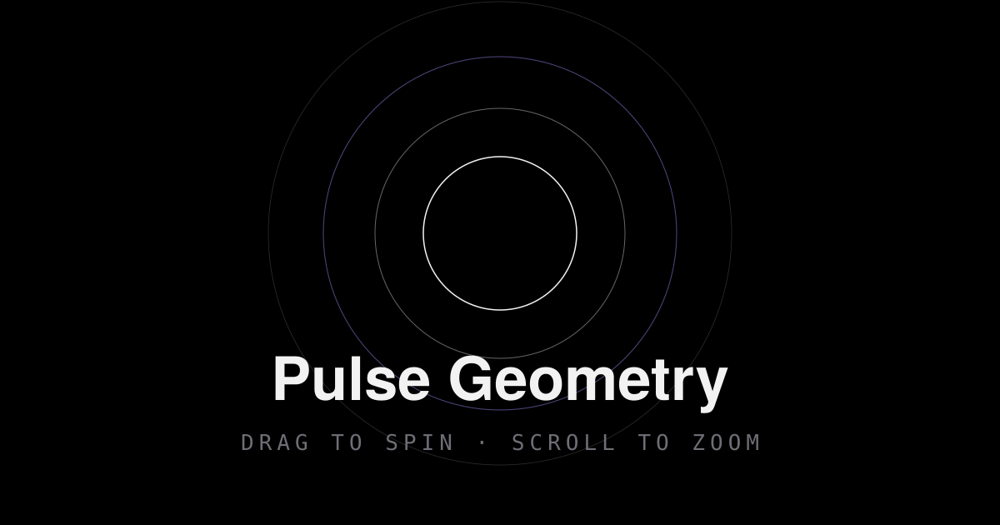

# Pulse Geometry

Psychedelic, trance-like interactive geometric visuals — pure client-side,
rendered on an HTML5 Canvas with additive glow, trails, and color cycling.

Pick a shape, hit **Start**, and let it pulse. Ten live knobs control the
motion, the glow, the warping, and the color; nothing leaves your browser.



## Features

- **Landing screen** — ambient drifting glow, a "Start — Random Shape"
  button, and an 8-shape picker (Circle, Triangle, Square, Hexagon, Star,
  Spiral, Flower of Life, Nested Polygons).
- **Live renderer** — a full-screen canvas with pulsing neon outlines,
  vertex warping, global rotation, per-layer hue shifting, after-image
  trails, and a soft central bloom.
- **Control panel** — Pulse Speed, Glow/Bloom, Stretch/Warp, Rotation
  Speed, Scale, Color Hue, Saturation, Color Cycle Speed, Complexity,
  and Trail Persistence. **Randomize** rolls a fresh set; **Reset**
  returns to the landing screen. The panel is a right-hand sidebar on
  desktop and a collapsible bottom sheet on mobile. Drag the corner
  grip to resize it on desktop.
- **Mouse camera** — click and hold the canvas and drag to spin the
  composition; use the mouse wheel to zoom in and out (exponentially,
  clamped to 0.4×–3×). Works with touch drag too.
- **Inactivity freeze (mandatory behavior)** — after **5 full minutes**
  with no mouse movement, touch, wheel, key, or input activity, the
  rendering loop stops and the canvas freezes on the last frame. A
  "Paused" overlay appears; clicking anywhere (or the "Back to Start"
  button) returns to the landing screen and clears the session.
- **Adaptive quality** — if the rolling average frame rate drops below
  ~40 fps, the internal resolution is halved once for a smooth degrade
  on weaker devices. `prefers-reduced-motion` gets calmer defaults.

## Tech stack

- [Vite](https://vite.dev) + vanilla **TypeScript** — no framework, tiny bundle
- **HTML5 Canvas 2D** with `shadowBlur` glow, additive (`lighter`)
  bloom, and fade-fill trails — no WebGL, no libraries
- Pure CSS (custom properties, no framework) for the UI
- 100% static output — deployable anywhere

## Project structure

```
pulse-geometry/
├── index.html              # App shell: landing + renderer views
├── package.json
├── tsconfig.json
├── vite.config.ts          # base './' so dist/ works from any host
├── wrangler.toml           # Cloudflare Pages build config
├── public/
│   ├── favicon.svg
│   └── og-image.svg
└── src/
    ├── main.ts             # Bootstrap: view switching, wiring, inactivity
    ├── style.css           # All styles (dark theme, panel, sliders)
    ├── types.ts            # Shape + Params interfaces
    ├── engine/
    │   ├── colors.ts       # hsl() helpers
    │   ├── params.ts       # Default + random parameter sets
    │    ├── renderer.ts     # Animation loop, trails, bloom, camera, quality guard
    │   └── stroke.ts       # strokeGlow() primitive + polar helpers
    ├── shapes/
    │   ├── index.ts        # Shape registry (add new shapes here)
    │   ├── polygon.ts      # Triangle, Square, Hexagon, Nested
    │   ├── circle.ts
    │   ├── star.ts
    │   ├── spiral.ts
    │   └── flower.ts       # Flower of Life lattice
    └── ui/
        ├── controls.ts     # Slider panel + Randomize / Reset
        └── inactivity.ts   # 5-minute activity tracker
```

## Run locally

Requires Node.js 20.19+ (or 22.12+).

```bash
npm install
npm run dev        # http://localhost:5173
```

## Build & preview

```bash
npm run build      # typechecks (tsc --noEmit) then builds into dist/
npm run preview    # serve the production build locally
```

## Deploy (free — Cloudflare Pages, preferred)

### Option A — Cloudflare dashboard (no CLI)

1. Push this folder to a GitHub repo.
2. In the Cloudflare dashboard: **Workers & Pages → Create → Pages →
   Connect to Git**, pick the repo.
3. Build command: `npm run build` · Output directory: `dist`.
4. Deploy. You get a `*.pages.dev` URL instantly, plus your own domain
   under **Custom domains**.

### Option B — Wrangler CLI

```bash
npm install -g wrangler   # or: npx wrangler
wrangler login

# Create the project (first time)
wrangler pages project create pulse-geometry

# Deploy the built output
npm run build
wrangler pages deploy dist --project-name pulse-geometry
```

### Option C — GitHub Actions (auto-deploy on every push)

The repo ships a workflow (`.github/workflows/deploy.yml`) that builds and
deploys to Cloudflare Pages on **every push to `main`**. Live site:
**https://pulse-geometry.pages.dev**

**One-time setup** (the only manual step is creating the API token):

1. Create a Cloudflare API token: dashboard → **My Profile → API Tokens →
   Create Token → "Edit Cloudflare Workers"** template (or a custom token)
   with *Account: Cloudflare Pages: Edit* and *Account: Workers Scripts: Edit*.
2. Add it as a repo secret so the workflow can deploy:

   ```bash
   gh secret set CLOUDFLARE_API_TOKEN --repo brycejensen540/shapes
   ```

3. Push to `main` — the workflow builds and deploys automatically. Watch it
   under **Actions** on GitHub; deployments appear in the Pages project.

> The workflow only runs once the secret exists — until then pushes will show
> a failed "Deploy to Cloudflare Pages" check, which is expected.

### Any other static host

Because `vite.config.ts` sets `base: './'`, the built `dist/` folder is
fully self-contained and works as-is on Netlify, Vercel, GitHub Pages,
or any static file server. Netlify/Vercel: build command `npm run build`,
publish directory `dist`.

## Adding a new shape

1. Create `src/shapes/myShape.ts` exporting a `Shape`:

   ```ts
   import type { Shape } from '../types';
   import { strokeGlow, polar } from '../engine/stroke';
   import { hsl } from '../engine/colors';

   export const myShape: Shape = {
     id: 'my-shape',
     name: 'My Shape',
     icon: '<path d="M24 8 40 40 8 40 Z" />', // SVG for the picker
     render(ctx, t, p, r, hue) {
       const color = hsl(hue, p.saturation, 60);
       const points = [polar(r, 0), polar(r, t), polar(r, 1.5)];
       strokeGlow(ctx, points, true, color, { glow: p.glow * 14, width: 1.1 });
     },
   };
   ```

2. Register it in `src/shapes/index.ts`:

   ```ts
   import { myShape } from './myShape';
   export const shapes: Shape[] = [/* ...existing... */, myShape];
   ```

That's it — the picker, the random button, and the renderer all pick it
up automatically. Use `strokeGlow` for consistent glow/bloom, read
`p.complexity` to vary detail, and shift `hue` per layer for the
rainbow-cycling effect.

## Inactivity freeze — how it works and how to verify it

The tracker in `src/ui/inactivity.ts` listens for `pointermove`,
`pointerdown`, `touchstart`, `wheel`, `keydown`, and `input` events on
`window` (slider changes fire `input`, so knob activity counts too).
Any event resets a 5-minute timer. When it fires, the renderer's
`stop()` cancels the animation frame loop — the canvas is *not* cleared,
so the last composited frame stays frozen — and the "Paused" overlay is
shown. The tracker disarms until the next session starts.

**To verify without waiting 5 minutes**, run the dev server, start a
shape, then in the browser console:

```js
window.__pulseGeometry.simulateInactivity();
```

The animation freezes instantly and the overlay appears; clicking
anywhere returns to the landing screen. The real 5-minute timer uses
the exact same code path. `state()` also reports the current camera
(`zoom` and `rotation`) so you can confirm the drag/wheel controls
from the console.

## Scripts

| Script              | What it does                                  |
| ------------------- | --------------------------------------------- |
| `npm run dev`       | Vite dev server with hot reload               |
| `npm run build`     | Typecheck + production build into `dist/`     |
| `npm run preview`   | Serve the production build locally            |
